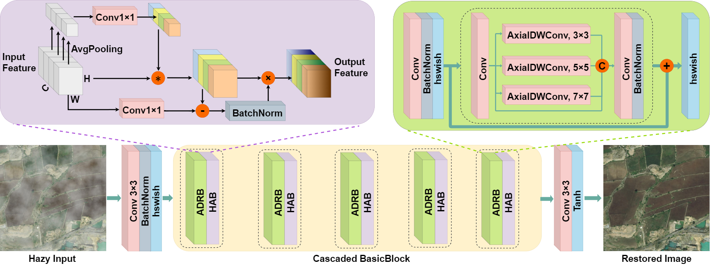

# LRSDN
the official repository of the paper "A Lightweight CNN Based on Axial Depthwise Convolution and Hybrid Attention for Remote Sensing Image Dehazing"

<center>

</center>


> Hazy weather reduces contrast, narrows the dynamic range, and blurs the details of the remote sensing image. Additionally, color fidelity deteriorates, causing color shifts and image distortion, thereby impairing the utility of remote sensing data. In this paper, we propose a lightweight remote sensing-image-dehazing network, named LRSDN. The network comprises two tailored, lightweight modules arranged in cascade. The first module, the axial depthwise convolution and residual learning block (ADRB), is for feature extraction, efficiently expanding the convolutional receptive field with little computational overhead. The second is a feature-calibration module based on the hybrid attention block (HAB), which integrates a simplified, yet effective channel attention module and a pixel attention module embedded with an observational prior. This joint attention mechanism effectively enhances the representation of haze features. Furthermore, we introduce a novel method for remote sensing hazy image synthesis using Perlin noise, facilitating the creation of a large-scale, fine-grained remote sensing haze image dataset (RSHD). Finally, we conduct both quantitative and qualitative comparison experiments on multiple publicly available datasets. The results demonstrate that the LRSDN algorithm achieves superior dehazing performance with fewer than 0.1M parameters. We also validate the positive effects of the LRSDN in road extraction and land cover classification applications.


**Now, you can download RSHD dataset**:

Baidu Link：https://pan.baidu.com/s/1e1YlHJtFtp7K562dJ5uANg?pwd=w5ra 
Code：w5ra


GoogleDrive：https://drive.google.com/file/d/1ueyfp6RTY4FhsgDowyeG35yFMoHUwwac/view?usp=sharing

The source code of LRSDN will be released as soon as possible.

## Citation

If you find our work useful in your research, please cite:

```tex
@Article{he2024a,
	AUTHOR = {He, Yufeng and Li, Cuili and Li, Xu and Bai, Tiecheng},
	TITLE = {A Lightweight CNN Based on Axial Depthwise Convolution and Hybrid Attention for Remote Sensing Image Dehazing},
	JOURNAL = {Remote Sensing},
	VOLUME = {16},
	YEAR = {2024},
	NUMBER = {15},
	ISSN = {2072-4292},
	DOI = {10.3390/rs16152822}
}
```

https://doi.org/10.3390/rs16152822


